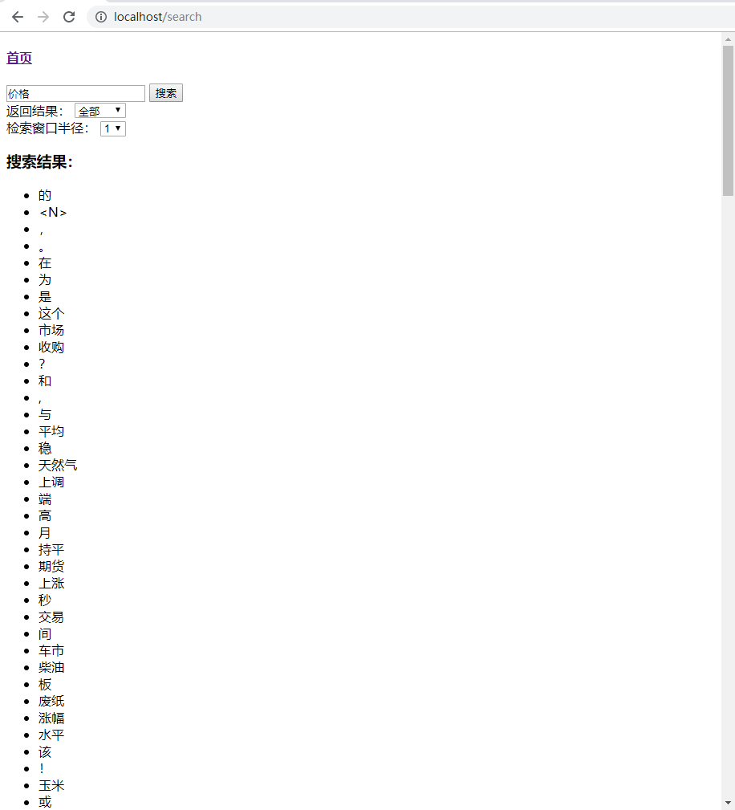
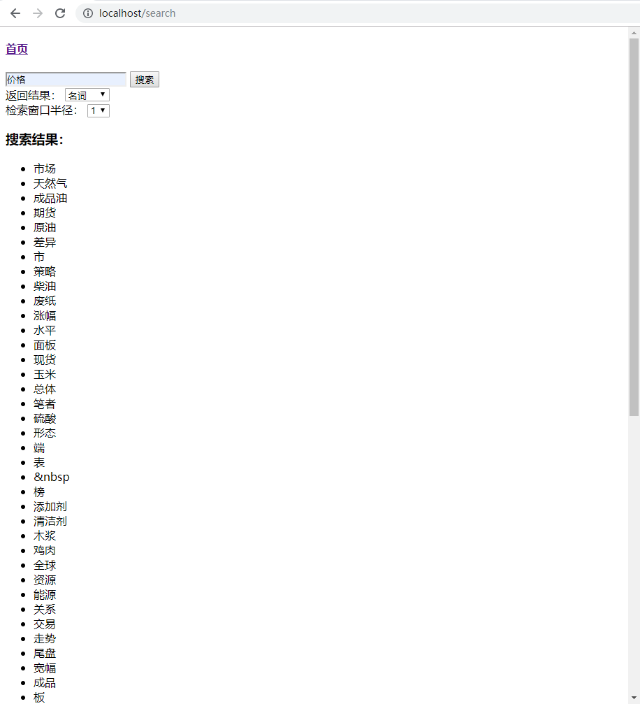
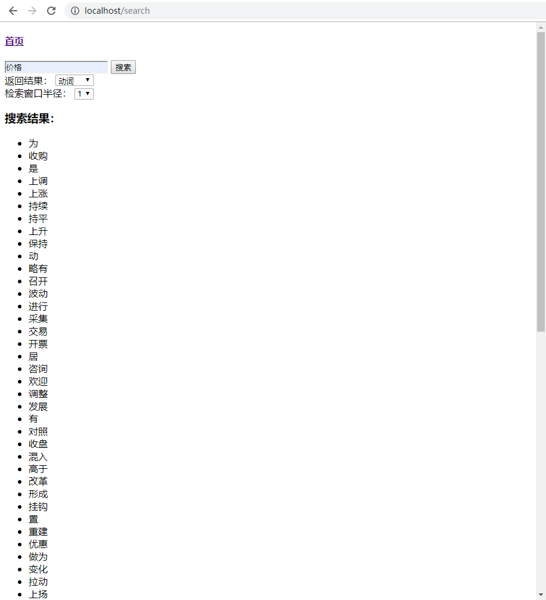
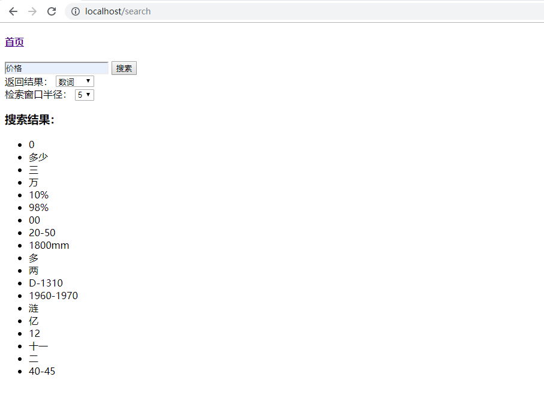
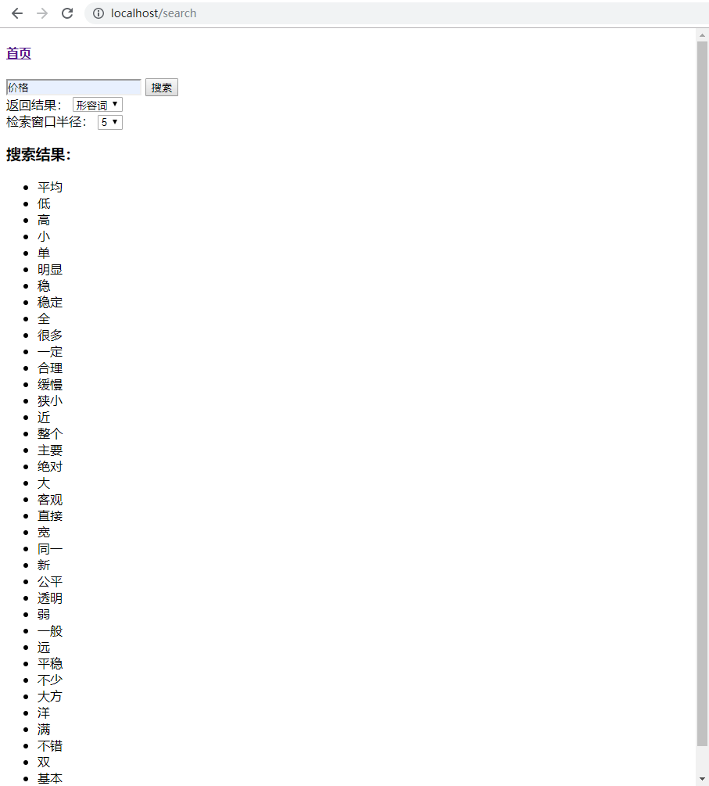
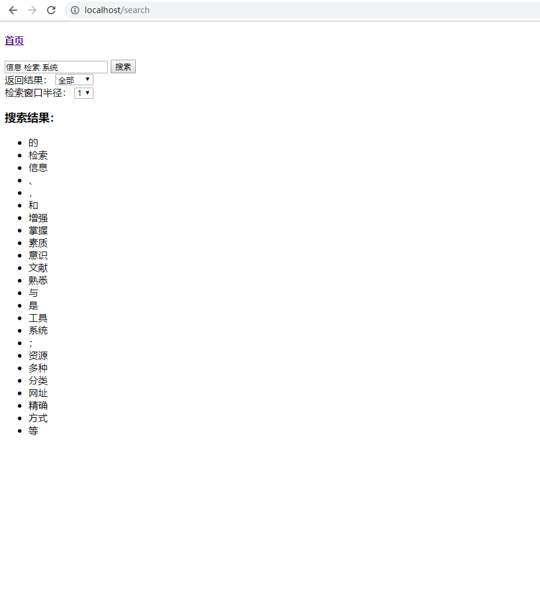

# 关键词常见搭配检索系统
---

### 项目架构
- 操作系统 Windows 10
- 检索系统采用 ElasticSearch 7.5
- 采用Go脚本将文本数据导入至 ElasticSearch Server
- WEB服务器采用 Python(3.6) Flask(1.0.2)

### 项目文件
- app：Python server
- bin：Go可执行脚本
- config.py：server配置
- run.py：server启动入口

### 项目部署
- 安装运行 ElasticSearch 于 `localhost:9200`

- 依赖库安装：
    `pip install -r requirements.txt`

- 导入文本数据
    - 下载不带词性和带词性的文本数据
    - 将文本数据拷贝到 `elastic_loader.go` 或 `elastic_loader.exe` 同目录下
    - 运行 `go run elastic_loader.go -f XXX -s 0`
        - 其中，-f 参数为文件名，-s 参数为新增线程的暂停时间，单位是毫秒，可以根据机器性能设置，数字越大，导入越慢，不设置则默认为0
        - 若无Go环境，可以直接运行 `./bin` 文件夹内的可执行文件，注意：要导入的文本文件需要与执行脚本同目录
    - 等待导入完成

- 更新server的配置，编辑 `config.py`，将`ELASTIC_INDEX`设置为不带词性的数据文件名，
将`ELASTIC_INDEX_WITH_PART`设置为带词性的数据文件名

- 运行server：
    `python run.py` 或：  
    `python run.py debug` (debug模式)  

#### 项目效果
- **检索词：`价格`**
- 返回关键词常见搭配的结果
    

- 给定返回词的词性，返回常见搭配的结果
    - 名词
        
    - 动词
        
    - 数词
        
    - 形容词
        

- 给定检索词和关键词距离限制，返回常见搭配的结果
    - 数词
        
    - 形容词
        

- 给定多个关键词，返回相应的结果
    
    

### 语料库
- 规模：Sogou0016的所有数据，包括只分词不标注词性的数据和分词且标注词性的数据
- Elastic 采用 `RESTFUL API` 的形式导入数据，支持分布式
- 为了提高文本导入速度所以选择了用Go语言，不过限于机器性能，只完成了Sogou0016的数据导入

### 改进空间
- 利用 Elastic 的分布式特性，增加节点
- 利用 Elastic 的 `_bulk API` 特性，增加导入脚本的批处理功能，进一步提升索引构建效率
- 返回关键词词性支持多选
- UI优化，界面美化
